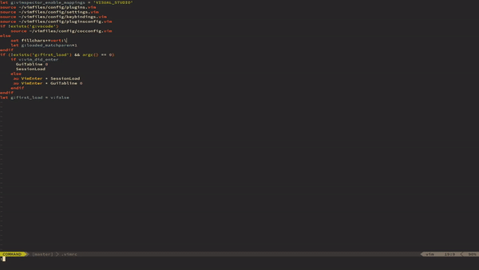
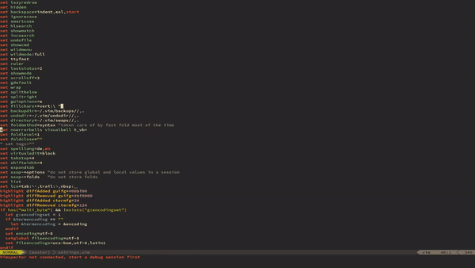

# Gistory - Git History in Vim

Git log has great tools to find commits which are relevant to a file, a span, or a regex. It is also really unweildy.  
Fugitive's diffing is a great tool to compare files but is defeated by git churn.  
Code formatters are really good at removing git churn.

This Vim plugin assembles the pieces to do `git blame`'s job right.

Youtube video example:

- `:Gistory` loads all commits which affect the current file into the quickfix list in a new tab. 
- You always see the diff between the new and previous commit
- Navigate the quickfix list to jump to commits
- Gistory normalizes whitespace and runs lsp formatters via coc.nvim to clean up diffs

Selecting a range only shows commits that affect that range. Git tries to track how this range changed over time, so if there is too much git churn all changes will be shown.

Git pickaxe can be used with `Gistory -S string`. This shows commits where the number of matches of `string` changed - great if a code formatter made span tracking useless. To use a regex, try `--pickaxe-regex`.

Dependencies:

- fugitive
- coc.nvim

The dependency for coc.nvim for formatting is fairly superficial. If it causes problems, please speak up!

## Three Way Merge

 
The plugin has a `ThreeWayMerge` command to help with merges. This opens both versions and the common ancestor as diffs in three tabs:

- you & past & me
- past & me
- past & you

The opened files are named accordingly.  Note that this runs whitespace normalization, empty lines and trailing whitespace will likely be gone after merging and formatters may be run.

`ThreeWayMerge!` replaces the workspace buffer by the common ancestor, allowing quick merging with diffput and diffget.

Video example: https://www.youtube.com/watch?v=LPqTLjO88yA&feature=youtu.be
