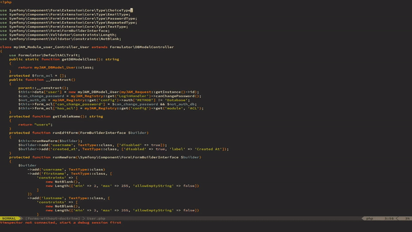

# Gistory - Better Git Blame

Git has great tools to find commits which are relevant to a file, a span, or a regex. This vim plugin makes them accessible.

- `:Gistory` loads all commits which affect the current file into the quickfix list in a new tab. 
- You always see the diff between the new and previous commit
- Navigate the quickfix list to see different tabs
- Normalize whitespace and run lsp formatters via coc.nvimto clean up diffs

Selecting a range only shows commits that affect that range. Git tries to track how this range changed over time, so if there is too much git churn all changes will be shown.

Git pickaxe can be used with `Gistory -S regex`. This shows commits where the number of matches of `regex` changed - great if a code formatter made span tracking useless.

Dependencies:

- fugitive
- coc.nvim

The dependency for coc.nvim for formatting is fairly superficial. If it causes problems, please speak up!
